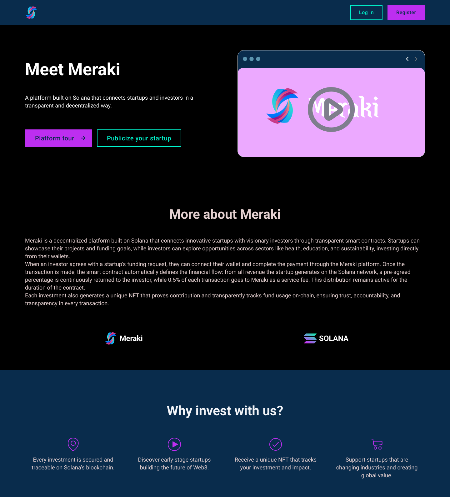

<p align="center">
  
</p>


<p align="center">
  <strong>Web3 Investment Platform for Startups in the Solana Ecosystem</strong>
</p>

<p align="center">
  <a href="#">Live Demo</a> |
  <a href="#">Docs</a> |
  <a href="#">Project Overview</a> |
  <a href="https://discord.gg/V75mWm2k">Join our Community</a>


</p>

<p align="center">
  
</p>

---


---

## Table of Contents
- [Introduction](#introduction)
- [Problem & Solution](#problem--solution)
- [Key Features](#key-features)
- [Tech Stack](#tech-stack)
- [Architecture](#architecture)
- [Setup & Installation](#setup--installation)
- [Using in Production](#using-in-production)
- [Video Demo](#video-demo)
- [Roadmap](#roadmap)

---

## Introduction
**Meraki** is a Web3 platform built within the **Solana ecosystem**, designed to connect **emerging startups** with **investors** who want to support innovative projects transparently, traceably, and securely.

Our mission is to **simplify early-stage investments**, removing bureaucracy and providing a **trustless environment** where entrepreneurs can share their ideas and investors can safely support them — all recorded **on-chain**.

Each investment generates a **tracking NFT**, which serves as a **proof of investment** and a **trust token**. This NFT visually evolves as the startup achieves its milestones, making the process **transparent, gamified, and engaging**.

---

## Problem & Solution

### Problem
Early-stage startup investments are often opaque, slow, and risky. Investors struggle to verify progress, and startups waste time on bureaucracy instead of growth.

### Solution
Meraki provides a transparent, gamified, and secure investment platform built on Solana. Each investment generates a dynamic NFT tracking the startup’s milestones, creating a **trustless, verifiable, and engaging experience**.

---

## Key Features

- **Total Transparency** — Every investment and milestone is recorded on the **Solana blockchain**.  
- **Gamified Trust System** — Dynamic **NFTs evolve visually** as startups progress.  
- **Fast & Low-Cost Transactions** — Powered by Solana’s **high-speed, low-fee** infrastructure.  
- **Direct Interaction** — Enables **peer-to-peer communication** between investors and founders.  
- **Secure Smart Contracts** — Investment logic built using **Anchor Framework** on Solana.  
- **Tracking NFTs** — Each NFT represents an investment and evolves with milestones.  

<p align="center">
  
</p>

---

## Tech Stack

| Layer | Technology |
|-------|-------------|
| **Frontend** | Next.js, TypeScript, Solana Wallet Adapter |
| **Backend** | Node.js, Express, PostgreSQL |
| **Blockchain** | Solana, Anchor, Rust |
| **Integration** | Web3.js, Metaplex, Phantom Wallet |

---

## Architecture
**Frontend** — Next.js + TypeScript  
│  
▼  
**Backend** — Node.js + Express + PostgreSQL  
│  
▼  
**Blockchain Layer** — Solana (Anchor + Rust)  
│  
▼  
**NFT Engine** — Metaplex (Dynamic Evolution)

- Users connect wallets via **Phantom / Solana Wallet Adapter**  
- Investments trigger **smart contract execution**  
- Smart contract **mints a tracking NFT**  
- NFT evolves visually when milestones are completed  

---

## Setup & Installation

```bash
# Clone repository
git clone (https://github.com/Emanuellydias19/Meraki)
cd Meraki

# Install dependencies
npm install

# Run frontend
npm run dev

# Run backend server
npm run server
Connect your Solana wallet (Phantom, Solflare) to start investing or creating projects.
```

## Using in Production
- Ensure Solana mainnet connection
- Deploy smart contracts via Anchor
- Connect frontend to backend API
- Mint NFTs through Metaplex
- Track startup milestones and update NFTs dynamically

## Video Demo

  
## Roadmap
- Advanced analytics dashboard for investors
- Social features for startup communities
- Gamification enhancements for NFTs
- Automated milestone verification via oracles


